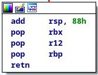

# Kernel Explotation Notes

 These are my personal notes on some kernel exploitation techniques

 ## ChallengE: kernel-rop from hxpCTF 2020

 This challenge exploits a simple buffer overflow in a kernel module.

#### Setup

You are given the file [kernel-rop-bf9c106d45917343.tar.xz](https://2020.ctf.link/assets/files/kernel-rop-bf9c106d45917343.tar.xz), which has the following contents: 

```bash
Dockerfile
initramfs.cpio.gz # Compressed file system
pow-solver.cpp 
run.sh # bash script to run the kernel image with qemu
vmlinuz # Compressed kernel image
ynetd
```

The file **run.sh** tells qemu how to run the image (-kernel), which filesystem to use (-initrd) and where to store the flag.txt file (-hdb), in this case the file flag.txt will be in */dev/sda*  and not accessible unless you are root. So the objective is to become root and read the contents of */dev/sda* 

```bash
#!/bin/sh
qemu-system-x86_64 \
    -m 128M \
    -cpu kvm64,+smep,+smap \
    -kernel vmlinuz \
    -initrd initramfs.cpio.gz \
    -hdb flag.txt \
    -snapshot \
    -nographic \
    -monitor /dev/null \
    -no-reboot \
    -append "console=ttyS0 kaslr kpti=1 quiet panic=1"
```

In this case we can see that the SMEP, [SMAP](https://en.wikipedia.org/wiki/Supervisor_Mode_Access_Prevention), KSLR y KPTI mitigation features are active. Also note that for debugging purposes we can add the -s flag to this file.

To disable these mitigation features we can edit the -append line adding [nokaslr](https://git.kernel.org/pub/scm/linux/kernel/git/torvalds/linux.git/commit/?id=8ab3820fd5b2896d66da7bb2a906bc382e63e7bc) and nopti, and remove +smep,+smap from the -cpu line, for example:

```bash
#!/bin/sh
qemu-system-x86_64 \
    -m 128M \
    -cpu kvm64 \
    -kernel vmlinuz \
    -initrd initramfs.cpio.gz \
    -hdb flag.txt \
    -snapshot \
    -nographic \
    -monitor /dev/null \
    -no-reboot \
    -append "console=ttyS0 nokaslr nopti quiet panic=1"
```

will deactivate all these mitigation features.

In order to understand what we are given a little bit better we can extract the image (in order to find [ROP](https://github.com/everettjf/Papers/blob/master/Introduction%20to%20Return%20Oriented%20Programming%20(ROP).pdf) gadgets) and uncompress the filesystem. 

To extract the image we can use [extract-image.sh](https://github.com/torvalds/linux/blob/master/scripts/extract-vmlinux) from the official linux repository.

```bash
./extract-image.sh ./vmlinuz > vmlinux			
```

To uncompress the filesystem we can run:

```bash
mkdir filesystem; cd filesystem
cp ../initrams.cpio.gz .
gunzip ./initrams.cpio.gz
cpio -idm < ./initrams.cpio
```

inside the newly created filesystem folder there is now a file called **hackme.ko** which is a Linux kernel module and we can use the free version of IDA to disassemble it. Some inspection shows that the functions *hackme_write* and *hackme_read* are vulnerable to a buffer overflow.


In order to be able to communicate with the kernel module we need to open it, this gives a handle which we can use to read and write to it.

```C
int handle;
void get_handle() {
    handle = open("/dev/hackme", O_RDWR);
    if ( handle < 0) {
        exit(-1);
    } 
}
```

**TODO**: Understand what is a kernel module (besides drivers).

We can use the buffer overflow in *hackme_read* to obtain the stack cookie. If **KASLR** is disabled this can be done as follows:

```C
unsigned long cookie;
void leak_cookie(void) {
    unsigned long leak[18];
    ssize_t r = read(handle, leak, sizeof(leak));
    cookie = leak[16];
    printf("Cookie: %lx\n", cookie);
}
```

[Why SMEP/SMAP can't be disbled by altering the CR4 register](https://patchwork.kernel.org/project/linux-hardening/patch/20190220180934.GA46255@beast/)

Before continuing an important difference from userland functions and kernel modules is that kernel module functions pop 3 registers at the end of their execution, instead of just **rbp**



## MITIGATION FEATURES

### stack cookie / canary

A stack cookie protects the return address on the stack by first checking the canary value before moving the return address from the stack to the **EIP**. To bypass this protection we need a way to read this value, bruteforce it or a jumping overflow (TODO: look for example of jumping overflow).

### SMEP

A means to prevent execution out of untrusted application memory while operating at a more privileged level

### SMAP

SMEP can be used to prevent supervisor mode from unintentionally executing user-space code. SMAP extends this protection to reads and writes.

### KASLR

[**ASLR** bypasses](https://security.stackexchange.com/questions/20497/stack-overflows-defeating-canaries-aslr-dep-nx):

- Direct RET overwrite - Often processes with ASLR will still load non-ASLR modules, allowing you to just run your shellcode via a `jmp esp`.
- Partial EIP overwrite - Only overwrite part of EIP, or use a reliable information disclosure in the stack to find what the real EIP should be, then use it to calculate your target. We still need a non-ASLR module for this though.
- NOP spray - Create a big block of NOPs to increase chance of jump landing on legit memory. Difficult, but possible even when all modules are ASLR-enabled. Won't work if DEP is switched on though.
- Bruteforce - If you can try an exploit with a vulnerability that doesn't make the program crash, you can bruteforce 256 different target addresses until it works.

### kpti

Kernel Page Table Isolation separates the page tables used by the kernel from those belonging to user space.